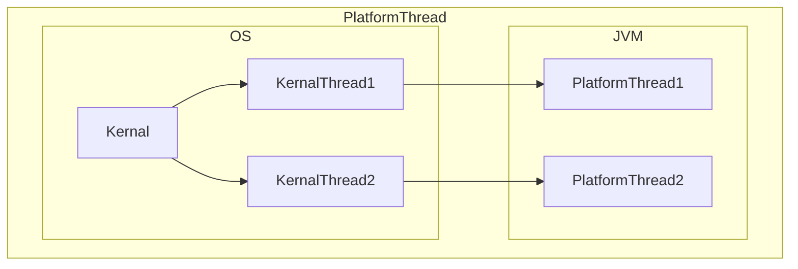
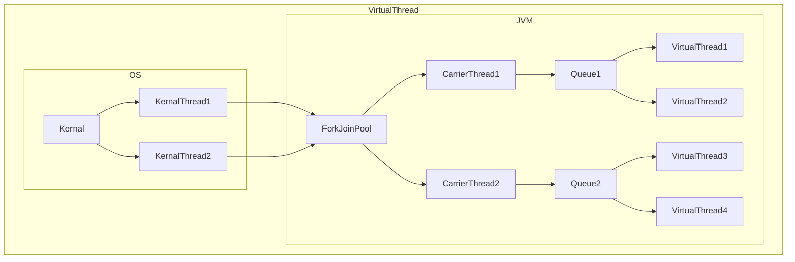

from [Dictionary - VirtualThread](https://github.com/newkayak12/Dictionary/blob/master/java/29.VirtualThread.md)

# VirtualThread

! 간단 정리 버전 !


## 기본 구성
Project Loom에서 시작되었으며, Java19에는 [Preview](https://openjdk.org/jeps/425)로 지원되었고 21에서 정식으로 추가됐다.
기본 발상은 Java의 쓰레드는 Kernal Thread를 할당 받아서 사용했었는데 이는
1. 할당까지 OS의 영향하에 있다.
2. 할당까지 비용이 너무 많이 든다.
3. 1 ~ 2MB가 최대 



라는 문제가 근본적으로 있었다. 그래서 이를 극복하기 위해서 `ThreadPool`를 할당하여 쓰고 버리는 것이 아닌 반납 하는 시스템으로 자주 사용했다.
VirtualThread는 기존 쓰레드(PlatformThread)와 달리 JVM 단에서 쓰레드를 만들어서 실행하는 방향으로 발상을 바꾸게 되어 생겼다. 이를 통해서 
 
1. JVM의 영향력 아래 있다.
2. 할당에 비용이 적게 들어서 쓰고 버리는 형태로 패러다임이 변경됐다.
3. ~ KB 단위 사이즈

는 식의 변화가 생겼다. 이러면서 기존 쓰레드는 `PlatformThread`로 개명했다.



> ### 캐리어 쓰레드란?
> Proeject Loom의 일부로 도입된 개념으로 `VirtualThread`를 실행하기 위한 운반체 역할을 한다. 
> PlatformThread를 기반으로 합니다. 
> CarrierThread는 `ForkJoinPool` 안에 workerThread로 생성이 되어 스케쥴링 된다.


## VirtualThread
VirtualThread Thread(Runnable을 구현한)를 상속 받았다. 따라서 상호 변용이 가능하다. 
```java
package java.lang;
sealed abstract class BaseVirtualThread extends Thread
        permits VirtualThread, ThreadBuilders.BoundVirtualThread {
    BaseVirtualThread(String name, int characteristics, boolean bound) {
        super(name, characteristics, bound);
    }
    abstract void park();
    abstract void parkNanos(long nanos);
    abstract void unpark();
}
```
```java
package java.lang;
/**
 * A thread that is scheduled by the Java virtual machine rather than the operating
 * system.
 */
final class VirtualThread extends BaseVirtualThread {
//... 중략
private static final long CARRIER_THREAD = U.objectFieldOffset(VirtualThread.class, "carrierThread");
    // carrier thread when mounted, accessed by VM
    private volatile Thread carrierThread;
}
```


## 주의점
1. 쓰고 버리는게 오히려 이득이다.
2. 커넥션 풀을 사용하는 경우(MySQL 같이)나 IO 최대 개수 제한이 있는 경우(OS 파일) 문제가 될 수 있으니 Bound를 두고 사용하는게 맞을 수 있다.