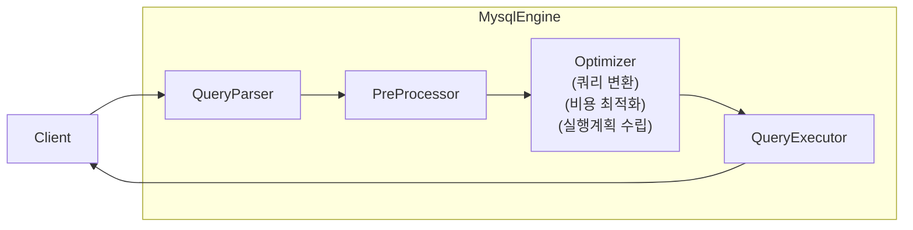

# MysqlEngine

## 엔진
MySQL은 크게 두 가지로 구성된다.

1. MySQL 엔진 : 클라이언트 접속 및 쿼리 요청을 처리한다. 또한 요청된 SQL를 분석, 최적화하는 처리를 수행한다.
2. 스토리지 엔진 : 실제 질의에 따른 디스크 쓰기/읽기를 전담한다.

### MYSQL 엔진
핸들러, SQL 파서, 전처리기, 옵티마이저로 구성된다.


### 스토리지 엔진
스토리지 엔진은 방식에 따라 MyISAM, Memory, InnoDB 등이 있다.


## 쓰레드

MySQL 쓰레드 기반으로 작동하며 `BACKGROUND`/ `FOREGROUND` 작업으로 나뉜다.
같은 이름이 여러 개 보인다면 병렬로 처리하기 때문이다.

```sql
select name, type from performance_schema.threads;
```

| name | type |
| :--- | :--- |
| thread/sql/main | BACKGROUND |
| thread/sql/thread\_timer\_notifier | BACKGROUND |
| thread/innodb/io\_ibuf\_thread | BACKGROUND |
| thread/innodb/io\_log\_thread | BACKGROUND |
| thread/innodb/io\_read\_thread | BACKGROUND |
| thread/innodb/io\_read\_thread | BACKGROUND |
| thread/innodb/io\_read\_thread | BACKGROUND |
| thread/innodb/io\_read\_thread | BACKGROUND |
| thread/innodb/io\_write\_thread | BACKGROUND |
| thread/innodb/io\_write\_thread | BACKGROUND |
| thread/innodb/io\_write\_thread | BACKGROUND |
| thread/innodb/io\_write\_thread | BACKGROUND |
| thread/innodb/page\_cleaner\_thread | BACKGROUND |
| thread/innodb/srv\_lock\_timeout\_thread | BACKGROUND |
| thread/innodb/srv\_error\_monitor\_thread | BACKGROUND |
| thread/innodb/srv\_monitor\_thread | BACKGROUND |
| thread/innodb/srv\_master\_thread | BACKGROUND |
| thread/innodb/srv\_purge\_thread | BACKGROUND |
| thread/innodb/srv\_worker\_thread | BACKGROUND |
| thread/innodb/srv\_worker\_thread | BACKGROUND |
| thread/innodb/srv\_worker\_thread | BACKGROUND |
| thread/innodb/buf\_dump\_thread | BACKGROUND |
| thread/innodb/dict\_stats\_thread | BACKGROUND |
| thread/sql/signal\_handler | BACKGROUND |
| thread/sql/compress\_gtid\_table | FOREGROUND |
| thread/sql/one\_connection | FOREGROUND |
| thread/sql/one\_connection | FOREGROUND |


### FOREGROUND(ClientThread)

최소 서버에 접속된 클라이언트 수만큼 존재하며, 각 클라이언트 요청에 대응한다. 커넥션이 종료되면 쓰레드가 `쓰레드 캐시`로 반환되는 식으로
사용된다.

또한, 데이터 버퍼, 캐시를 가져오거나, 직접 디스크의 데이터, 인덱스를 읽어와 작업을 처리할 떄도 사용된다.

### BACKGROUND

보통 InnoDB는 buffer -> disk 과정을 백그라운드 쓰레드로 처리한다. 그 밖에도

1. insert buffer 병합하는 쓰레드
2. 로그를 디스크로 기록하는 쓰레드
3. innoDB 버퍼풀 데이터를 디스크로 기록하는 쓰레드
4. 데이터를 버퍼로 읽어오는 쓰레드
5. 잠금, 데드락 모니터링 쓰레드

가 있다.

FOREGROUND는 지연될 수 없는 것 (요청에 대해서 읽어서 보여야하는 것)이 주로 운용되고 지연시킬 수 있는 것(쓰기, 수정, 삭제, 다음 페이지 읽어오기)
등은 BACKGROUND로 동작한다.


## 메모리 할당 및 구조

MySQL은 글로벌, 로컬 메모리로 구분된다.

- 글로벌 : MySQL 서버가 시작되면서 OS로부터 할당받는다. 모든 쓰레드에 의해서 공유된다.
    - 테이블 캐시
    - innoDB 버퍼 풀
    - innoDB 어댑티브 해시 인덱스
    - innoDB 리두 로그 버퍼
- 로컬 : 세션 메모리라고도 부른다. 클라이언트 커넥션 당으로 할당된다. 쓰레드별로 독립적으로 할당된다.
    - 커넥션 버퍼
    - 조인 버퍼
    - 바이너리 로그 캐시
    - 네트워크 버퍼


## 핸들러 
MySQL 엔진 -> 스토리지 엔진으로 요청할 때 핸들러를 통해서 진행한다.

| Variable\_name | Value |
| :--- | :--- |
| Handler\_commit | 13475565 |
| Handler\_delete | 36760 |
| Handler\_discover | 81 |
| Handler\_external\_lock | 0 |
| Handler\_icp\_attempts | 121 |
| Handler\_icp\_match | 121 |
| Handler\_mrr\_init | 0 |
| Handler\_mrr\_key\_refills | 0 |
| Handler\_mrr\_rowid\_refills | 0 |
| Handler\_prepare | 0 |

이런 핸들러는 컴포넌트 형식으로 확장할 수도 있다.

## 쿼리 실행




### 쿼리 파서
쿼리를 토큰으로 분리해 트리 구조로 만드는 과정을 한다.


### 전처리기
파서 트리 기반으로 쿼리 문장에 구조적 문제점 있는지 확인 

### 옵티마이저
쿼리 문장을 저렴한 비용으로 실행하기 위한 비용 산정을 한다.

### 핸들러
보통 스토리지 엔진의 영역이 된다. 


---------

* tableSpace: 테이블, 인덱스, 뷰 프로시저 등을 저장해 놓은 공간(물리적)


