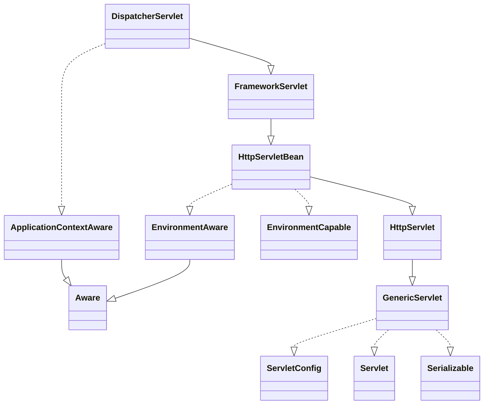

# DispatcherServlet

spring6 기준 `org.springframework:spring-webmvc`에 포함되어 있다.
Http 프로토콜로 도달하는 모든 요청을 Servlet 구현체로서 처음 받아 적합한 컨트롤러에 위임한다.




## 작동 과정

```java
class DispatcherServlet implements FrameworkServlet {
    protected void doDispatch(HttpServletRequest request, HttpServletResponse response) throws Exception { //1)
        HttpServletRequest processedRequest = request;
        HandlerExecutionChain mappedHandler = null;
        boolean multipartRequestParsed = false;
        WebAsyncManager asyncManager = WebAsyncUtils.getAsyncManager(request);

        try {
            try {
                ModelAndView mv = null;
                Exception dispatchException = null;

                try {
                    processedRequest = this.checkMultipart(request);
                    multipartRequestParsed = processedRequest != request;
                    mappedHandler = this.getHandler(processedRequest); //2)
                    if (mappedHandler == null) {
                        this.noHandlerFound(processedRequest, response);
                        return;
                    }

                    HandlerAdapter ha = this.getHandlerAdapter(mappedHandler.getHandler()); //3)
                    String method = request.getMethod();
                    boolean isGet = HttpMethod.GET.matches(method);
                    if (isGet || HttpMethod.HEAD.matches(method)) {
                        long lastModified = ha.getLastModified(request, mappedHandler.getHandler());
                        if ((new ServletWebRequest(request, response)).checkNotModified(lastModified) && isGet) {
                            return;
                        }
                    }

                    if (!mappedHandler.applyPreHandle(processedRequest, response)) {
                        return;
                    }

                    mv = ha.handle(processedRequest, response, mappedHandler.getHandler()); //3) 핸들링
                    if (asyncManager.isConcurrentHandlingStarted()) {
                        return;
                    }

                    this.applyDefaultViewName(processedRequest, mv);
                    mappedHandler.applyPostHandle(processedRequest, response, mv);
                } catch (Exception var20) {
                    Exception ex = var20;
                    dispatchException = ex;
                } catch (Throwable var21) {
                    Throwable err = var21;
                    dispatchException = new ServletException("Handler dispatch failed: " + err, err);
                }

                this.processDispatchResult(processedRequest, response, mappedHandler, mv, (Exception)dispatchException);
            } catch (Exception var22) {
                Exception ex = var22;
                triggerAfterCompletion(processedRequest, response, mappedHandler, ex);
            } catch (Throwable var23) {
                Throwable err = var23;
                triggerAfterCompletion(processedRequest, response, mappedHandler, new ServletException("Handler processing failed: " + err, err));
            }

        } finally {
            if (asyncManager.isConcurrentHandlingStarted()) {
                if (mappedHandler != null) {
                    mappedHandler.applyAfterConcurrentHandlingStarted(processedRequest, response);
                }
            } else if (multipartRequestParsed) {
                this.cleanupMultipart(processedRequest);
            }

        }
    }

    protected void render(ModelAndView mv, HttpServletRequest request, HttpServletResponse response) throws Exception {
        Locale locale = this.localeResolver != null ? this.localeResolver.resolveLocale(request) : request.getLocale();
        response.setLocale(locale);
        String viewName = mv.getViewName();
        View view;
        if (viewName != null) {
            view = this.resolveViewName(viewName, mv.getModelInternal(), locale, request);
            if (view == null) {
                String var10002 = mv.getViewName();
                throw new ServletException("Could not resolve view with name '" + var10002 + "' in servlet with name '" + this.getServletName() + "'");
            }
        } else {
            view = mv.getView();
            if (view == null) {
                throw new ServletException("ModelAndView [" + mv + "] neither contains a view name nor a View object in servlet with name '" + this.getServletName() + "'");
            }
        }

        if (this.logger.isTraceEnabled()) {
            this.logger.trace("Rendering view [" + view + "] ");
        }

        try {
            if (mv.getStatus() != null) {
                request.setAttribute(View.RESPONSE_STATUS_ATTRIBUTE, mv.getStatus());
                response.setStatus(mv.getStatus().value());
            }

            view.render(mv.getModelInternal(), request, response);
        } catch (Exception var8) {
            Exception ex = var8;
            if (this.logger.isDebugEnabled()) {
                this.logger.debug("Error rendering view [" + view + "]", ex);
            }

            throw ex;
        }
    }
}
```

1. 요청이 들어옴 ( doDispatch)
2. `getHandler()`로 사전에 등록된 `HandlerMapping`을 찾음
3. `HandlerAdapter ha = this.getHandlerAdapter(mappedHandler.getHandler());`로 핸들러 어댑터를 찾고 `mv = ha.handle(processedRequest, response, mappedHandler.getHandler());`로 핸들링
4. Controller -> Service 등 비즈니스 로직 처리됨
5. `mv = ha.handle(processedRequest, response, mappedHandler.getHandler());`로 @ResponseBody가 있다면 OutStream으로 뱉고 `mv`는 null
6. `ModelAndView` 리턴, view가 있다면 찾고 render로 렌더링
