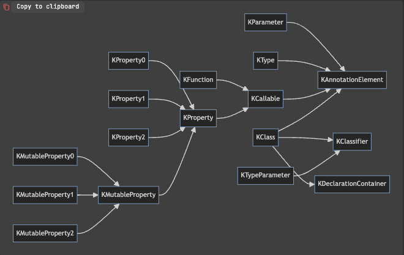

# Reflection

## 지정자와 타입
- KClass<T>: 컴파일 시점에 T 타입인 클래스나 인터페이스, 객체 선언을 런타임에 표현
  1. isAbstract: Boolean
  2. isCompanion: Boolean
  3. isData: Boolean
  4. isFinal: Boolean
  5. isInner: Boolean
  6. isOpen: Boolean
  7. isSealed: Boolean
  8. visibility
     - KVisibility [PUBLIC, PROTECTED, INTERNAL, PRIVATE]
  9. constructor: 객체 선언이라면 빈 컬렉션을 반환. 이 경우 objectInstance 프로퍼티를 사용해야 한다.
  10. members
  11. nestedClass
  12. typeParameter
- KTypeParameter: 어떤 제네릭 선언의 타입 파라미터를 표현
  1. isReified: Boolean
  2. name: String
  3. upperBounds: List<KType>
  4. variance: KVariance : KVariance enum으로 변성을 돌러준다.
    - isMarkedNullable: null 가능성
    - classifier: 지정자. 지정자는 타입을 정의하는 클래스, 인터페이스나 객체 선언을 가리킨다.
    - 타입 프로퍼티에 전달된 실제 타입 인자 목록
- 타입 별명을 표현하는 reflectionAPI가 없다.
- `::class`를 사용하면 결과 값에 대한 런타임 클래스를 얻을 수 있다.

## 호출 가능
- callable은 어떤 결과를 얻기 위해서 호출할 수 있는 함수나 프로퍼티를 함께 묶어준다.
- KCallalbe<out R>이라고 표현한다.
  - val isAbstrasct: Boolean
  - val isFinal: Boolean
  - val isOpen: Boolean
  - val isSuspend: Boolean : 일시 중단 가능한 계산을 지원하는 호출 가능 객체에서 사용한다.
  - val visibility: KVisibility
- call()이라는 함수가 있어서 호출할 수 있다.

- KParameter는 멤버 및 확장 선언의 수신 객체나 함수/생성자의 파라미터에 대한 정보를 포함한다.
  - val index: Int
  - val isOptional: Boolean
    - INSTANCE
    - EXTENSION_RECEIVER
    - VALUE
  - val isVararg: Boolean
  - name: String?
  - type: KType
  - kind: KParamter

  - KProperty/KMutableProperty: 프로퍼티에만 있는 변경자를 검사하는 프로퍼티를 추가로 제공한다.
    - val isConst: Boolean
    - val isLateinit: Boolean

- KFunction: 다양한 인자 개수를 지원해야 하므로 어떤 함수 타입도 상속하지 않는다.
  - val isInfix: Boolean
  - val isInline: Boolean
  - val isOperator: Boolean
  - val isSuspend: Boolean

- 추가로 리플렉션을 이용하면 가시성이 제한되는 요소에도 접근할 수 있다. `setAccessible(true)`로 설정하면 말이다.

