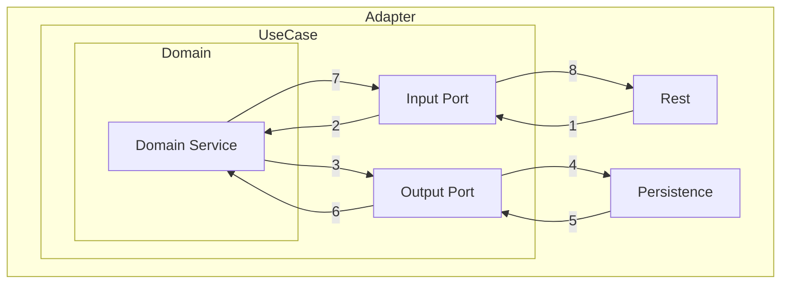

> - [일전의 공부한 내용](./rollup-2025-01.firstHalf.html)을 실제로 구현해보면서 공부해보고자 시작한 프로젝트다.
> - [이전 글](https://newkayak12.github.io/mini_project/book/2025/08/22/mini-project-08-Kotlin과-JPA?.html)
> - 아직 공부 중인 개념입니다. 조금 틀려도 너른 이해 부탁드립니다!
> - 이 글은 개인적인 의견을 다룹니다.

# 다루는 내용
- Port and Adapter(Hexagonal)을 적용하면서 고민한 점

---
# Port and Adapter를 적용하면서  
  
## 목차  
### 1. 기하급수적으로 늘어나는 보일러 플레이트 코드  
### 2. 복잡해지는 매핑 과정  
### 3. input port와 output port   
### 4. Application:Service의 사이즈에 대한 고민  
### 5. Query, Command 분리  
### 6. domain service의 구성  
### 7. domain repository, event에 대해서 ### 8. domain entity와 JPA entity  
### 9. Persistence에서 Adapter의 역할과 쓰임새  
  
  
  
## 1. 기하급수적으로 늘어나는 보일러 플레이트 코드  
  
<pre>
adapter-module  
  ﾤ rest
    ﾤ {{domain}} 
         ﾤ request
         ﾤ response
         ﾤ {{action}}
 ﾤ persistence
    ﾤ {{domain}}  
        ﾤ entity
            ﾤ {{domainEntity}}
        ﾤ repository                            
            ﾤ dsl
            ﾤ jpa
            ﾤ adapter
	    ﾤ infrastructure
				ﾤ config
				ﾤ redis
application-module  
    ﾤ {{domain}}
         ﾤ port
            ﾤ input
                ﾤ query                        
                ﾤ command
                ﾤ {{UseCase}}  
            ﾤ output
                ﾤ {{output port}}
         ﾤ usecase                
             ﾤ {{actionService}}
             ﾤ exception
core-module  
    ﾤ {{domain}}
        ﾤ exception
        ﾤ policy
        ﾤ service
        ﾤ vo
        ﾤ {{entity}}
</pre>

- 위와 같이 패키지 트리가 복잡하다.  
  - service를 구현하기 위한 inputPort, outputPort 인터페이스  
  - 같은 데이터를 운반하지만 계층별 분리를 위한 DTO  
  - JPA Entity와 Domain Entity의 분리   
- Domain에서 사용하는 Serivce  
- 분명 layered architecture에 비하면 굉장히 복잡하다.  
- 위와 같은 복잡한 코드는 필연적으로 순수 비즈니스 로직에 대한 것 보다는 경계를 지키기 위한, 태를 갖추기 위한 코드들도 증가하게 된다.  
- 그럼에도 트레이드 오프를 감수하고서라도 위 아키텍쳐를 사용하는 이유는 아래와 같다.  
  
> 1. architecture 를 강제함으로써 사람이 끼어들 여지를 줄인다.  
>   1. 위와 같은 아키텍쳐 구성은 초기 비용이 높지만 단단하게 구성되어 있어 사람의 해석에 따른 오용을 막을 수 있다.  
>   2. 구조적으로 강제되어 있어 오히려 고민할 여지를 줄여주고 나아갈 방향을 명확하게 제시한다.  
> 2. 안에서 바깥으로 개발할 수 있다.  
>   1. 특정 기술에 묶이는 것이 아니라 상세 내역을 완전 배제함으로써 순수 Java/Kotlin으로 문제를 정의하고 해결할 수 있다.  
>   2. 또한 정의한 문제를 해결하는 과정에서 완결된 문제 풀이 방식을 Test를 통해서 검증할 수 있다.  
> 3. 언제든 세부사항을 바꿀 수 있다.  
>   1. 실제로 JPA와 Kotlin의 궁합이 좋지 못하기 때문에 jOOQ 혹은 Exposed로 기술을 변경하는 것을 고려한 적이 있다. 위와 같은 상황에서는 무엇을 바꿔야하는지 명확해진다.  
>   2. 위와 같이 바꿔야 하는 곳, 아닌 곳을 완벽하게 분리할 수 있다.  
  
- 위와 같은 모습은 OOP의 OCP, SRP와 연관이 깊다.  
- 이러한 이점이 복잡성, 많은 코드 작성량 등의 단점보다 크므로 선택할 수 있는 충분한 선택지라고 보인다.  
  
## 복잡해지는 매핑  
  
```kotlin  
  
data class FindRestaurantResponse(  
    val identifier: String,  
    val company: FindRestaurantCompanyResponse,  
    val userId: String,  
    val information: FindRestaurantInformationResponse,  
    val phone: String,  
    val address: FindRestaurantAddressResponse,  
    val workingDays: List<FindRestaurantWorkingDayResponse> = listOf(),  
    val photos: List<FindRestaurantPhotoResponse> = listOf(),  
    val tags: List<FindRestaurantTagResponse> = listOf(),  
    val nationalities: List<FindRestaurantTagResponse> = listOf(),  
    val cuisines: List<FindRestaurantTagResponse> = listOf(),  
) {  
    companion object {  
        private fun mapCategory(  
            id: Long,  
            title: String,  
            categoryType: CategoryType,  
        ) = FindRestaurantTagResponse(id, title, categoryType)  
  
        fun from(result: FindRestaurantQueryResult): FindRestaurantResponse {  
            val company =  
                FindRestaurantCompanyResponse(  
                    companyId = result.company.companyId,  
                    companyName = result.company.companyName,  
                )  
  
            val information =  
                FindRestaurantInformationResponse(  
                    name = result.information.name,  
                    introduce = result.information.introduce,  
                )  
  
            val address =  
                FindRestaurantAddressResponse(  
                    zipCode = result.address.zipCode,  
                    address = result.address.address,  
                    detail = result.address.detail,  
                    coordinate =  
                        FindRestaurantCoordinateResponse(  
                            latitude = result.address.coordinate.latitude,  
                            longitude = result.address.coordinate.longitude,  
                        ),  
                )  
            val workDays =  
                result.workingDays.map {  
                    FindRestaurantWorkingDayResponse(  
                        it.day,  
                        it.startTime,  
                        it.endTime,  
                    )  
                }  
  
            val tags = result.tags.map { mapCategory(it.id, it.title, it.categoryType) }  
            val nationalities =  
                result.nationalities.map {  
                    mapCategory(  
                        it.id,  
                        it.title,  
                        it.categoryType,  
                    )  
                }  
            val cuisines = result.cuisines.map { mapCategory(it.id, it.title, it.categoryType) }  
  
            return FindRestaurantResponse(  
                identifier = result.identifier,  
                company = company,  
                userId = result.userId,  
                information = information,  
                phone = result.phone,  
                address = address,  
                workingDays = workDays,  
                photos = result.photos.map { FindRestaurantPhotoResponse(it.url) },  
                tags = tags,  
                nationalities = nationalities,  
                cuisines = cuisines,  
            )  
        }  
    }  
  
    data class FindRestaurantCompanyResponse(  
        val companyId: String,  
        val companyName: String,  
    )  
  
    data class FindRestaurantInformationResponse(  
        val name: String,  
        val introduce: String,  
    )  
  
    data class FindRestaurantAddressResponse(  
        val zipCode: String,  
        val address: String,  
        val detail: String,  
        val coordinate: FindRestaurantCoordinateResponse,  
    )  
  
    data class FindRestaurantCoordinateResponse(  
        val latitude: BigDecimal,  
        val longitude: BigDecimal,  
    )  
  
    data class FindRestaurantWorkingDayResponse(  
        val day: DayOfWeek,  
        val startTime: LocalTime,  
        val endTime: LocalTime,  
    )  
  
    data class FindRestaurantPhotoResponse(  
        val url: String,  
    )  
  
    data class FindRestaurantTagResponse(  
        val id: Long,  
        val title: String,  
        val categoryType: CategoryType,  
    )  
}
```  
- 위와 같이 점점 매핑이 복잡해진다. 또한 계층마다 변환을 시도하므로 오버헤드가 높아진다.  
  

  
1. `request -> input port` : 세부 사항 구현과 내부 usecase로 진입에 대한 변환한다.  
2. `input port -> domain` : usecase에서 domainService로 전달할 때 값을 변환한다.  
3. `domain -> output port` : domainService에서 변환한 내용을 세부 사항에 저장할 때 변환한다.  
4. `output port -> persistence` : usecase에서 결정된 내용을 세부 사항 구현에 맞춰서 변환한다. (Plain Object -> JPA Entity)  
5. `persistence -> output port` : 세부사항에서 저장한 내용을 가져올 때 변환한다.  
6. `output port -> domain` : 저장된 내용으로 domainService에서 중요 작업을 할 때 변환한다.  
7. `domain -> input port` : domainService에서 만들어진 결과를 세부 사항으로 반환할 때 변환한다.  
8. `input port -> request` : usecase에서 세부 사항에 결과를 반환할 때 변환한다.  
  
- 위와 같이 최소 4번 이상의 변환이 수반된다.  
- 이러한 변환 과정은 **분명히 매우 복잡하고 귀찮으며 손이 많이 가는 일**이다.  
- 그럼에도 불구하고 위와 같은 작업을 진행하는 이유는 각 계층간 데이터 전송에서 생기는 **결합도를 제거하는 것**이다.  
- 이러한 변환 과정을 별도 **Mapper**를 두는 방법이 있고, DTO에 변환 과정에 대한 책임을 부과하는 경우도 있다.  
  - 이 프로젝트에서는 DTO에 변환 과정을 부여했으며, 내부에 알아도 되는 계층의 DTO 타입의 형태를 제공함으로써 객체 생성 책임을 본인에게 부과한다.  
  - 혹은 크기가 작다면 각 계층의 비즈니스 로직에도 부과했다.  
  
## 3. input port와 output port 


<pre>
{{example}}  
    ﾤ port  
       ﾤ input 
        ﾤ query 
        ﾤ Find~ByIdsUseCase
        ﾤ Find~ByTitleUseCase
       ﾤ output
        ﾤ Find~  
</pre>
  
- input port  
  - 배경  
    - 기존 `title`로 찾는 UseCase가 `Find~UseCase`로 구현되어 있었다.    
        - 새롭게 `ids`로 찾아야 하는 경우가 생겼다.  
        - 결과적으로 보면 단순 파라미터 즉, query의 `where`만 변경되고 return 타입은 같은 경우다.   
  - 이 경우 선택지는 아래와 같다.  
    1. 기존 UseCase의 파라미터에 새로운 파라미터를 추가한다.  
    2. 기존 UseCase의 이름을 바꾸고 새로운 UseCase를 작성한다.  
  - 1)을 선택하는 경우 결과적으로 코드는 깔끔해지지만 파라미터 추가하는 과정에서 기존 코드를 리팩토링해야 합니다.  
  - 2)을 선택하는 경우 간단하게 메소드를 추가할 수 있지만 코드는 복잡해질 수 있다.  
  - 이 프로젝트에서는 2)를 선택하고 같은 경우가 많아지면 1)로 변경하는 방향으로 선회하기로 했다.  
  - 이는 2)를 선택하면서 서로의 생애주기가 달라질 수 있는 상황을 상정하며, 검증 후 하나로 합치는 방향이 효율적이라고 생각했기 때문이다.  
  
- output port  
  - 배경  
    - 기존 `title`로 찾는 UseCase가 `Find~UseCase`로 구현되어 있었다.    
      - 새롭게 `ids`로 찾아야 하는 경우가 생겼다.  
      - 결과적으로 보면 단순 파라미터 즉, query의 `where`만 변경되고 return 타입은 같은 경우다.  
  - 이 경우 input과 유사한 선택지를 받을 수 있다.  
  - 이 프로젝트에서는 output port를 두 개로 유지하고 하나의 adapter에서 이를 구현하고 조율하는 방향으로 선택한다.  
  - 이를 통해서 내부에서는 각각을 다른 방향으로 생각하지만 외부적으로는 하나로 처리할 수 있음을 시사하는 것과 동시에 추후 생명 주기가 같다면 다시 하나로 합치는 방향으로 이행하기에 효과적이라고 생각했기 때문이다.  
  
## 4. Application:Service의 사이즈에 대한 고민  
- 현재 프로젝트를 진행하면서  application의 Service가 여러 UseCase를 구현하는 것이 좋은가 아닌가에 대한 고민이 있었다.  
- 이에 대해서 아래와 같은 원칙을 세웠다.  
  1. 하나의 서비스는 하나의 역할만 수행한다.  
  2. 원칙적으로 하나의 역할만 수행하지만, 같은 결이고, 생명 주기가 유사할 가능성이 있으면 하나로 합친다.  
- 위와 같은 선택을 한 이유는 **너무 많은 역할을 하는** 갓클래스를 만들지 않기 위함이 가장 크다.  
- 또한 결과적으로 합쳐질 수 있거나, 같은 주제를 가진 경우는 하나의 클래스에 역할 부여를 해도 문제가 없다는 생각이 있었기 때문이다.  
  
## 5. Query, Command 분리  
- 현 프로젝트에서는 Query, Command를 분리했다.  

<pre>
application-module  
    ﾤ {{domain}}       
         ﾤ port 
            ﾤ input
                ﾤ query
                ﾤ command
                ﾤ {{UseCase}}  
</pre>

- 위와 같은 조치는 CQS(Command-Query-Segregation)을 준수한 결과다.  
- 이는 코드를 더 예측 가능하게 하고 안전하게 한다.   
- Query는 SideEffect가 절대 없음을 보증한다.  
- 테스트를 쉽게하는 효과도 존재한다.  
- 이러한 측면에서 UseCase에 구성되는 인터페이스의 suffix로 `Query`, `Command`로 명시했던 적이 있다.   
- 그러나 UseCase의 목적이 `사용자의 목표를 달성하기 위한 애플리케이션의 핵심 비즈니스 로직`을 의미한다는 것에 있기도 하며, "Query, Command를 굳이 외부로 노출 시킬 필요가 있는가?" 라는 고민이 있어 현재와 같이 ~UseCase로 변경했다.  
- 대신, request, response에 `Query`, `Command`를 명시하는 방식으로 명확하게 표시했다.  
  
## 6. Domain Repository에 대한 고민  
### Domain Repository  
1.  배경: Domain Repository vs Output Port  
  
  > Port & Adapter를 적용하면서 Repository 패턴에 대한 두 가지 접근 방식을 고민하게 되었다:  
  >   
  > 1. **현재 방식**: Application Layer의 Output Port  
  > 2. **고려한 방식**: Core Module의 Domain Repository  
  
2. Domain Repository란 무엇인가?  
   - Domain Repository는 **Domain이 정의하는 영속성 계약**이다.   
  
```kotlin  
// Domain Repository: core-module에 위치  
interface UserRepository {  // Domain이 소유  
    fun findById(userId: UserId): User?     // 완전한 Domain Entity 반환  
    fun save(user: User): User              // Entity 영속성  
    fun findActiveUsers(): List<User>       // 도메인 의미 있는 쿼리  
}  
  
// vs Output Port: application-module에 위치  interface FindGeneralUser {  // UseCase가 소유  
    fun query(inquiry: FindGeneralUserInquiry): FindGeneralUserResult?  // DTO 반환  
}  
```  
  
**핵심 차이**: Domain Repository는 Domain Entity 중심으로, Output Port는 UseCase 중심으로 설계된다.  
  
3. 선택  
   1. UseCase별 인터페이스로 명확한 책임을 맡기는 것을 목표로 한다.  
   2. DDD의 문제를 푸는 풍부한 도메인 모델과 서비스 방식을 사용한다.  
   3. 도메인에 특화된 로직을 도메인 서비스에서 확장하고 이를 바탕으로 문제를 해결한다.  
- 위와 같은 이유로 `Domain Repository`를 따로 두고 있지 않다.   
  
### Domain Event  
> 1. 정의  
>    1. 도메인에서 발생한 중요한 비즈니스 사건을 나타내는 객체다.  
>    2. 도메인 전문가가 관심을 갖는 "~가 일어났다"는 사실이다.  
>   
> 2. 이벤트의 핵심 특징  
>    1. 불변성: 한 번 생성되면 변경 불가  
>    2. 과거형 명명: UserRegistered, OrderCancelled, PaymentCompleted  
>    3. 도메인 언어: 비즈니스 용어로 명명  
>    4. 자체 완결성: 이벤트만으로 무엇이 일어났는지 파악 가능  
>   
> 3. 사용 목적  
>    1. 결합도 감소  
>    2. 사이드 이펙트 분리  
>    3. 확장성  
>    4. 감사/ 추적  
  
- 현 프로젝트에서는 BoundedContext 간 결합도 제거를 위해서 사용할 수 있는 것이라 기대 중이다.  
- Spring에서 제공하는 EventPublisher, Listener를 통해서 간단하게 구현할 수 있으며 미래에는 외부 메시지 브로커를 두고 적용할 수도 있을 것이다.  
  
## 8. domain entity와 JPA entity  
- [이전](https://newkayak12.github.io/mini_project/2025/05/18/mini-project-03.DDD에-대한-고민.html)에도 기술한 바가 있는 주제다.  
- JPA, DDD의 Entity를 분리함으로써 JPA는 테이블 모델링에 집중할 수 있도록했으며, DDD Entity는 개념적인 엔티티, 풍부한 모델과 비즈니스 사항을 잘 반영할 수 있도록 했다.  

<pre>
adapter-module  
   ﾤ persistence   
    ﾤ {{domain}}
        ﾤ entity
		ﾤ category
core-module  
   ﾤ category
       ﾤ cuisine
      ﾤ nationality
      ﾤ tag  
</pre>
  
- 위와 같이 JPA로 표현한 테이블 Entity와 domain에서 사용하는 개념적 Entity가 불일치 할 수 있음을 인지하고 표현했다.  
- 이전에 기술한 바와 같이 항상 정답인 것은 **아니며** 상황에 따라 **취사 선택**하는 것이 좋다.  
- 분리하면 도메인에 더 적합한 표현을 할 수 있다는 장점이 있다.  
  
## 9. Persistence에서 Adapter의 역할과 쓰임새  
- 단순 데이터를 query하거나 update, save하는 것에서 멈추지 않고 DomainService에서 처리된, output port를 통해서 전달 된 값을 매핑하고 조정하는 책임을 한다.  
  
```kotlin  
@Component  
class ChangeRestaurantAdapter(  
    private val jpaRepository: RestaurantJpaRepository,  
) : ChangeRestaurant {  
    override fun command(inquiry: ChangeRestaurantInquiry): Boolean {  
        var result = false  
        jpaRepository.findRestaurantEntityById(inquiry.id)  
            .ifPresent {  
                it.updateDescription(inquiry.name, inquiry.introduce)  
                it.updateContact(inquiry.phone)  
                it.updateAddress(  
                    inquiry.zipCode,  
                    inquiry.address,  
                    inquiry.detail,  
                    inquiry.latitude,  
                    inquiry.longitude,  
                )  
  
                RestaurantNationalitiesMutator.adjustNationalities(  
                    it,  
                    inquiry.nationalities.map { nationality -> nationality.nationalitiesId },  
                )  
  
                RestaurantCuisinesMutator.adjustCuisines(  
                    it,  
                    inquiry.cuisines.map { cuisine -> cuisine.cuisinesId },  
                )  
  
                RestaurantTagMutator.adjustTags(  
                    it,  
                    inquiry.tag.map { tag -> tag.tagsId },  
                )  
  
                RestaurantPhotosMutator.adjustNationalities(  
                    it,  
                    inquiry.photos.map { photo -> photo.url },  
                )  
  
                RestaurantWorkingDayMutator.adjustWorkingDays(  
                    it,  
                    inquiry.workingDay.map { schedule ->  
                        WorkingDayMutatorForm(  
                            schedule.day,  
                            schedule.startTime,  
                            schedule.endTime,  
                        )  
                    },  
                )  
  
                result = true  
            }  
  
        return result  
    }  
}
```  
  
- 다소 복잡할 수 있지만 위와 같이 매핑을 진행하는 등의 JPA에 관련된 작업을 특화해서 진행하거나 Query에 대한 복잡한 Projection을 진행하기도 한다.  
- 이는 adapter 패턴의 정의를 바탕으로 결정한 것이다.  
> 호환되지 않는 인터페이스를 가진 클래스들이 함께 동작할 수 있도록 변환하는 구조 패턴  
> 기존 클래스의 인터페이스를 클라이언트가 기대하는 다른 인터페이스로 변환  
  
- 위와 같은 개념을 확장하여 구현하였고, 더 나아가 JPA의 1차 캐시를 적극적으로 사용할 수 있다는 점도 이와 같은 결정을 내리는데 주요했다.