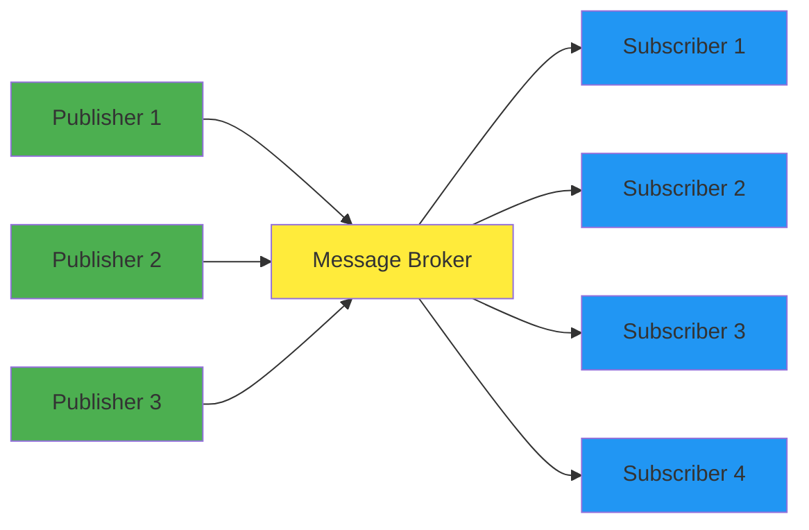

## 1. 기본 개념과 구조
### 1. 핵심 Idea
1. Pub-Sub을 통한 Observer Pattern


## 2.핵심 구성 요소
- **ApplicationEvent**: 모든 이벤트의 기본 클래스
- **ApplicationEventPublisher**: 이벤트 발행 인터페이스
- **ApplicationListener**: 이벤트 수신 인터페이스
- **@EventListener**: 어노테이션 기반 이벤트 리스너
- **ApplicationEventMulticaster**: 이벤트 멀티캐스팅 담당


## 3. 설계 원리
### 1. 느슨한 결합
1. Event만 정의하면 언제든 새로운 Listener 추가 가능
2. 비즈니스 로직과 횡단 관심사 분리
### 2. Observer Pattern의 Spring식 진화
1. GOF Observer 패턴의 한계점
	1. Subject가 Observer를 직접 관리 -> Subject-Observer 강결합
	2. TypeSafe하지 못함
	3. 순환 참조 가능성
2. Spring은?
	1. Container가 Bean으로 등록된 Listener 자동 발견
	2. Type 기반 자동 매칭
	3. LifeCycle과 통합 관리
### 3. IOC의 확장 개념
1. 일반적으로 IoC로 객체 생성, 의존성 주입의 제어 역전
2. Event IoC: 이벤트 발생과 처리의 제어 역전
	1. 필요한 다른 도메인의 서비스를 직접 선언하는 것이 아니라 이벤트 퍼블리셔를 통해서 간접적으로 접근
### 4. 횡단 관심사 분리 실형
1. SingleResponsibilityPrinciple의 구현체
	1. 핵심 비즈니스 로직, 부가 기능 완전 분리
	2. 각 Listener는 하나의 책임만 담당
	3. 새로운 횡단 관심사 추가 시 기존 코드 변경 X
2. OCP 실현
	1. 확장에 열림: 새로운 EventListener 추가
	2. 변경에 닫히는 부분: Publisher 코드 수정 불필요
### 5.TemplateMethodPattern과 설계의 일관성
#### Spring의 설계 철학
1. JDBC, Rest 모두 동일한 패턴
2. Framework가 흐름 제어, 개발자는 도메인 로직만
3. "Convention over Configuration" 철학의 실현

### 6. Reflection + AnnotationProcessing을 사용한 개발자 편의성 도모
1. `@EventListener` 자동 스캔
2. 이벤트 타입 자동 매칭
3. SpEL로 조건부 처리 지원
### 7. 비동기 처리와 자연스러운 통합
1. 이벤트 발행, 처리의 완전 분리
2. `@Async`로 비동기 전환 가능 
	1. 동기 처리가 기본
	2. ThreadPool 관리 Framework에 위임

### 8. 확장성과 커스터마이징 전략
1. 다층 확장포인트 제공
	1. ApplicationEventMulticaster 인터페이스 커스터마이징
	2. 커스텀 ApplicationEventPublisher 구현 가능
	3. EventListener 조건식과 순서 제어

## 3. 구현
### 1. Event 발행(Publisher)
```java
// ApplicationEventPublisher 인터페이스 (실제로는 ApplicationContext가 구현)
public interface ApplicationEventPublisher {
    void publishEvent(ApplicationEvent event);
    void publishEvent(Object event);  // Spring 4.2+ 임의 객체 지원
}

// AbstractApplicationContext의 실제 구현
protected void publishEvent(Object event, ResolvableType eventType) {
    // 1. ApplicationEvent로 래핑 (필요시)
    ApplicationEvent applicationEvent = wrapIfNecessary(event);
    
    // 2. ApplicationEventMulticaster에 위임
    getApplicationEventMulticaster().multicastEvent(applicationEvent, eventType);
    
    // 3. 부모 컨텍스트가 있으면 계층적 전파
    if (this.parent != null) {
        this.parent.publishEvent(event, eventType);
    }
}
```

### 2. ApplicationEventMulticaster 핵심 로직
```java
// SimpleApplicationEventMulticaster의 핵심 구현 (의사코드)
public void multicastEvent(ApplicationEvent event, ResolvableType eventType) {
    ResolvableType type = (eventType != null ? eventType : resolveDefaultEventType(event));
    
    // TaskExecutor 확인 (비동기 처리용)
    Executor executor = getTaskExecutor();
    
    // 적절한 Listener들 검색
    for (ApplicationListener<?> listener : getApplicationListeners(event, type)) {
        if (executor != null && supportsAsync(listener)) {
            // 비동기 실행
            executor.execute(() -> invokeListener(listener, event));
        } else {
            // 동기 실행
            invokeListener(listener, event);
        }
    }
}
```

### 3. Listener 검색과 타입 매칭
- ResolvableType 기반 매칭
```java
// GenericApplicationListener 인터페이스의 핵심 메서드들
public interface GenericApplicationListener extends ApplicationListener<ApplicationEvent> {
    boolean supportsEventType(ResolvableType eventType);
    boolean supportsSourceType(Class<?> sourceType);
    int getOrder();
}

// 타입 매칭 로직 (의사코드)
protected boolean supportsEvent(ApplicationListener<?> listener, 
                               ResolvableType eventType, Class<?> sourceType) {
    if (listener instanceof GenericApplicationListener) {
        GenericApplicationListener genericListener = (GenericApplicationListener) listener;
        return (genericListener.supportsEventType(eventType) && 
                genericListener.supportsSourceType(sourceType));
    }
    
    // SmartApplicationListener나 일반 ApplicationListener 처리
    ResolvableType declaredEventType = getResolvableType(listener);
    return (declaredEventType == null || declaredEventType.isAssignableFrom(eventType));
}
```

### 4. `@EventListener` 처리 메커니즘
- `@EventListener` 메소드 스캔
- `ApplicationListenerMethodAdapter`로 래핑
- `Reflection`으로 타입 파라미터 추출
```java
// ApplicationListenerMethodAdapter의 핵심 구조 (의사코드)
public class ApplicationListenerMethodAdapter implements GenericApplicationListener {
    private final Method method;
    private final ResolvableType declaredEventType;
    
    @Override
    public void onApplicationEvent(ApplicationEvent event) {
        Object[] args = resolveArguments(event);
        
        try {
            // 조건 평가 (SpEL)
            if (evaluateCondition(event)) {
                Object result = method.invoke(this.bean, args);
                
                // 반환값이 있으면 새로운 이벤트로 발행
                if (result != null) {
                    publishEvents(result);
                }
            }
        } catch (Exception ex) {
            handleListenerException(ex);
        }
    }
}
```

### 5. 비동기 처리, 순서 보장
- TaskExecutor 연동
	- `SimpleApplicationEventMulticaster.setTaskExecutor()` 설정
	- Listener별로 동기/비동기 선택 가능
	- `@Async` 어노테이션은 별도 AOP 프록시에서 처리

- 순서 보장 메커니즘
	- `@Order` 어노테이션 또는 `Ordered` 인터페이스
	- `AnnotationAwareOrderComparator`를 통한 정렬
	- 비동기 처리시에는 순서 보장 불가

## 4. 사용 예

#### 이벤트 정의
```java
public class OrderEvent extends ApplicationEvent {
    private final String orderId;
    
    public OrderEvent(Object source, String orderId) {
        super(source);
        this.orderId = orderId;
    }
    
    public String getOrderId() { return orderId; }
}
```

#### 이벤트 발행
```java
@Service
public class OrderService {
    @Autowired
    private ApplicationEventPublisher publisher;
    
    public void createOrder(String orderId) {
        // 비즈니스 로직
        saveOrder(orderId);
        
        // 이벤트 발행
        publisher.publishEvent(new OrderEvent(this, orderId));
    }
}
```

#### 이벤트 처리
```java
@Component
public class OrderEventHandler {
    
    @EventListener
    public void sendEmail(OrderEvent event) {
        System.out.println("이메일 발송: " + event.getOrderId());
    }
    
    @EventListener
    @Async
    public void updateInventory(OrderEvent event) {
        System.out.println("재고 업데이트: " + event.getOrderId());
    }
}
```