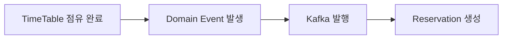
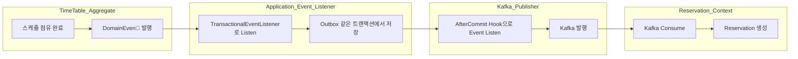
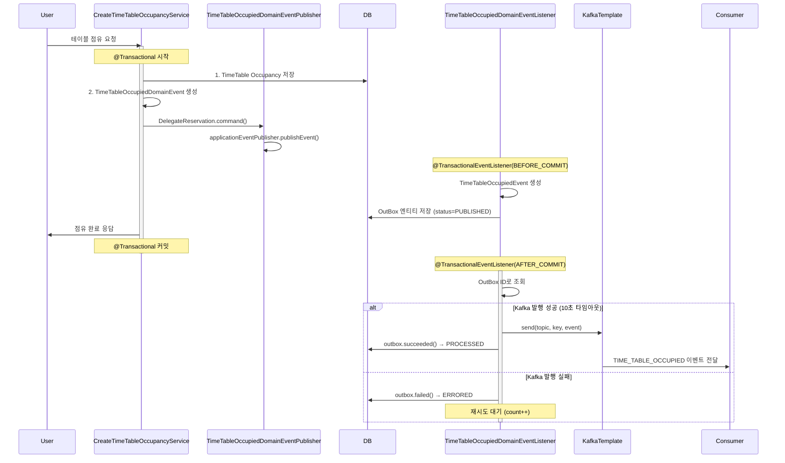
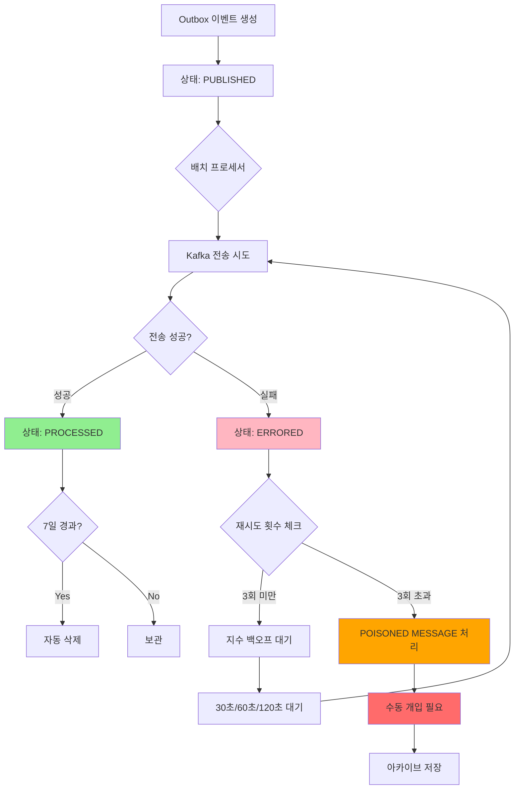
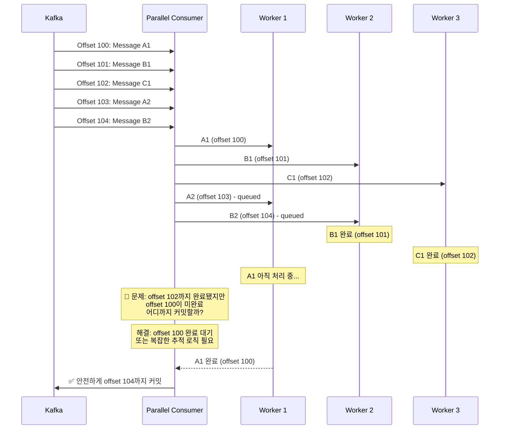

> - [일전의 공부한 내용](./rollup-2025-01.firstHalf.html)을 실제로 구현해보면서 공부해보고자 시작한 프로젝트다.
> - [이전 글](https://newkayak12.github.io/mini_project/book/2026/01/04/mini-project-12-Concurrency.html)
> - 아직 공부 중인 개념입니다. 조금 틀려도 너른 이해 부탁드립니다!
> - 이 글은 개인적인 의견을 다룹니다.

# 다루는 내용
- 도메인 로직을 다루면서 사용한 Kafka

---
# 도메인 로직을 다루면서 사용한 Kafka

## 목차
### 1. 서로 다른 도메인?
### 2. 고민한 아키텍쳐
### 3. Event, Outbox, ZeroPayload 
### 4.  Parallel Consumer

---
## 1. 서로 다른 도메인?
- 예약 시스템을 구성하면서 매장에서 기획하는 스케쥴과 사용자가 진행하는 예약은 다르다는 감각에서부터 시작했다.
- 실제로 이 둘은 서로 다른 **Bounded Context**에 속한다.
- 이를 구분하지 않으면 한 Aggregate가 다른 Aggregate를 생성하고 호출하는 Anti-Pattern이 발생할 수 있다.
- 또한 '예약 실패시 매장 스케쥴에 등록이 실패되어야 하는가?' 라는 고민이 됐었다.

## 2. 고민한 아키텍쳐

### 1. 단순 Spring Event의 도입
1. 장점
	1. 도입이 별도 인프라 없이 쉽다
	2. 도메인 간 직접 결합을 낮출 수 있다
	3. 확장성이 개선된다.
2. 단점
	1. 같은 JVM 내에서만 가능하다
	2. 서버 재시작시 이벤트가 유실된다.

### 2. 별도 인프라 도입
1. Redis Pub/Sub: 
	1. 장점
		1. Redisson을 사용하면 쉽게 도입할 수 있다.
	2. 단점
		1. 여전히 메시지 보장성이 부족하다
2. Kafka: 
	1. 장점
		1. 높은 처리량 
		2. 순서 보장( 파티션이 같다면 )
		3. 메시지 영속성
	2. 단점
		1. 별도 인프라 구성

> 결과적으로 위의 두 가지 모두를 선택했다.
> UseCase에서 

1. Domain Event
	1. Domain Event의 장점
		1.  Aggragate 간 강결합 제거
		2. 트랜잭션 분리
		3. Bounded Context 간 통신
	2. Domain Event의 특징
		1. 과거 시제로 명명한다.
		2. 불변 객체다.
		3. Event 처리에 최소 정보를 넘긴다.
2. DDD 관점에서 고려하면
	1. Domain이 비즈니스 로직 실행과 동시에 Event 발행의 주체가 된다.
	2. Domain 객체가 단순 데이터 덩어리가 아닌 자기 스스로 결정하는 행동을 가진 객체가 된다.
	3. Domain Event로 동작을 내부로 캡슐화가 가능하다.

> 그리하여 아래와 같은 flow로 표현할 수 있다.

	

## 3. Event, Outbox, ZeroPayload 
### 1. Event
1. 우선 Domain Event를 Kafka **Event로 변경하여 발행**하는 과정이 필요했다. Domain Event 발행 자체가 Outbox를 발행하고 Kafka를 Publish하는 것과 UseCase를 분리하기 위함에서 시작됐었다.
2. Kafka Event를 발행하면서 고민한 부분은 **이벤트 버전** 관리였다. 이벤트 자체는 같지만 내부 스키마에 따라 **하위 호환을 보장**해야 할 수도 있다는 고민이 들었다. 이에 따라 이벤트 버전을 명시하고 내리는 방향으로 진행했다.
3. **Topic** 의 경우 도메인명으로 할지, 이벤트로 할지 고민했으나 결과적으로 **이벤트**로 진행했다. 이는 Kafka Consumer의 **역할을 이벤트로 국한**시켜 별도 분기 없이 처리하기 위함이었다. 이는 배포 단위와도 겹치는 내용이 될 가능성이 높기 때문에 최대한 공용으로 사용하지 않아 영향이 적은 방향으로 모색하였다.

### 2. Outbox
1. Kafka Event 발행 시 '**데이터베이스에 쓰기는 성공했지만 Kafka Event 발행에는 실패**할 수도 있다.'는 고민에서 시작됐다.

2. 위와 같은 형태로 구현하였다.
	1. Spring TransactionalEventListener를 사용하여 'BEFORE_COMMIT'에서 Outbox 저장, 'AFTER_COMMIT'에서 Kafka Event를 발행
	2. 비즈니스 로직과 Kafka 발행이 전혀 다른 트랜잭션에서 실행되도록 설계됐다.
3. ACID를 보장할 수 있습니다. 비즈니스 데이터와 Outbox 이벤트가 동일 트랜잭션에서 저장됩니다.
4. Kafka 장애가 비즈니스 로직과 전혀 무관한 트랜잭션에서 진행됩니다.
5. 이벤트 유실을 방지하며, 중복 사안은 체크를 사전 체크를 통해서 멱등성을 보장합니다.

6. 아래와 같은 flow로 진행됩니다.

> 이를 통해서 아래와 같은 사실을 알 수 있다.
	1. Outbox의 상태 관리로 실패 처리를 진행할 수 있다.
	2. 지수 백오프와 최대 재시도 횟수를 제한하고 반복하여 재실행할 수 있다.
	3. 중복 방지를 위해서 멱등성 키로 Consumer 레벨에서 중복 처리를 진행할 수 있다.

### 3. ZeroPayload
1. Payload 전략으로는 `ZeroPayload`, `MinimalPayload`, `FullPayload`, `DelataPayload`, `ReferencePayload`  등이 있다.

> - ZeroPayload: 메시지 본문 없이 키와 헤더만 사용한다.
> - MinimalPayload: 식별자와 최소 필수 정보만 포함
> - FullPayload: 이벤트 관련 모든 데이터를 메시지에 포함
> - DeltaPayload: 변경된 필드만 전송(before/ after 변경분)
> - ReferencePayload: 데이터 저장 위치(URL) 참조 정보만 전달

2. 이와 같은 전략 중 `ZeroPayload`를 선택한 이유는 **이벤트 코드를 최소화**하고 Consumer가 RestAPI로 조회하여 늘 항상 최신 데이터를 조회하도록 유도할 수 있습니다. 마지막으로 **Kafka의 네트워크 트래픽을 감소**시킬 수 있다는 점도 한 몫했습니다.
3. 이러한 선택으로 스키마 변경에 유연해졌지만 RestAPI를 별도로 실행해야 한다는 단점이 생기기도 헀습니다.
## 4.  Parallel Consumer
1.  서로 독립된 이벤트에 대해서 파티셔닝을 진행하게 되는데 파티션 개수가 동시성을 결정한다.
2. 기본 Consumer는 파티션당 1개의 쓰레드만 사용한다.
3. Parallel Consumer는 하나의 파티션 당 여러 개의 쓰레드를 할당할 수 있게 해서 효율성을 올려준다.
4. 이는 파티션 수 수정 없이 수직 확장을 가능케 한다. 단, 여러 가지 어려움이 있지만 특히나 offset 관리가 복잡하다는 단점이 있다.

5. In-flight 상태, Out-of-order 현상에서 각각의 상태값을 추적하고 이전의 상태 값부터 연속하여 완료되어야만 offset을 commit 하도록 구현되어 있다.
6. 이러한 메커니즘으로 구현되어 있어 메시지 유실 없이 offset을 commit 할 수 있다.

> 이러한 선택은 다소 도전적일 수 있지만 Kafka의 동작을 더 잘 이해할 수 있는 계기가 되었다. 